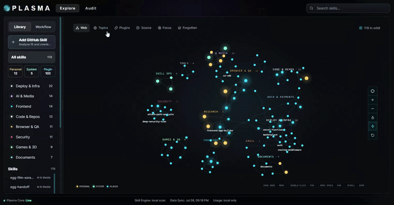
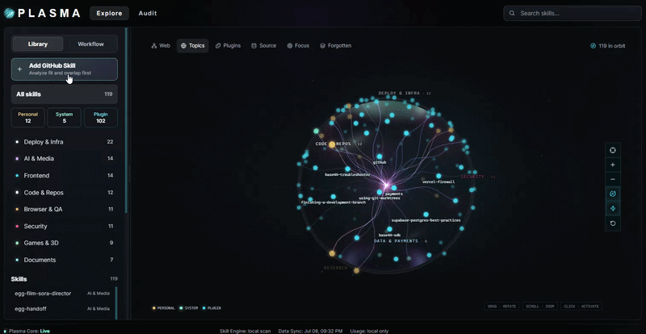

# Plasma


Plasma is a local-first dashboard for exploring AI agent skills and reusable workflow instructions. It scans installed `SKILL.md` files, builds a visual skill graph, and helps you understand which skills exist, what they are for, how they relate, and which ones are worth using next.

The app is designed for people with many skills, plugins, agents, or workflow helpers installed. It supports Codex-style `SKILL.md` libraries out of the box and can also scan labeled `SKILL.md` roots for other agent environments such as Claude, Gemini, Manus, or your own instruction folders. It runs locally and does not require an account, backend, telemetry service, or cloud sync.



## Beta Status

Plasma is beta software. The core dashboard is usable, but the graph model, generated data shape, and activation workflows may still change as the project matures.

## Features

- Local skill inventory from Codex-style folders plus optional labeled agent roots
- Plasma graph and glass globe views for exploring skill relationships
- Task-first skill suggestions through the mission bar
- Category, source, overlap, and duplicate signals
- Local token footprint estimates for each `SKILL.md`
- Optional local usage scan for supported session transcripts (Codex logs today)

## GitHub Skill Check

Paste a GitHub repo or folder link into Plasma before installing a skill. The dashboard analyzes the link against your local skill graph, highlights likely overlap, and gives you the install command only after you can see what it matches.



## Privacy

By default, `npm run dev` and `npm run build` scan installed skill files only. They do not scan agent session transcripts unless you explicitly opt in.

Optional usage scanning currently reads local Codex session JSONL files to count skill invocations. The scan is read-only and writes generated JSON to `src/data/generated/`, which is ignored by git.

See [PRIVACY.md](./PRIVACY.md) for details.

## Quick Start

Requirements:

- Node.js 22 or newer
- npm
- a local `SKILL.md` directory; Codex-style layouts under `~/.codex` work out of the box

Install and start the local app:

Windows PowerShell:

```powershell
git clone https://github.com/hkuxlicious/plasma.git
cd plasma
npm install
npm run dev
```

macOS / Linux:

```bash
git clone https://github.com/hkuxlicious/plasma.git
cd plasma
npm install
npm run dev
```

Open the local URL printed by Vite, usually:

```text
http://127.0.0.1:5173/
```

## Add Agent Libraries

Plasma scans `CODEX_HOME` or `~/.codex` by default. To add Claude, Gemini, Manus, or any other `SKILL.md`-compatible instruction folder, set `PLASMA_AGENT_SKILL_ROOTS` before running `npm run dev`.

Use `Label=path` entries. Separate entries with `;` on Windows and `:` on macOS/Linux. Adjust the paths to wherever you keep each agent's exported or converted `SKILL.md` folders.

Windows PowerShell:

```powershell
$env:PLASMA_AGENT_SKILL_ROOTS="Claude=$env:USERPROFILE\.claude\skills;Gemini=$env:USERPROFILE\.gemini\skills;Manus=$env:USERPROFILE\.manus\skills"
npm run dev
```

macOS / Linux:

```bash
export PLASMA_AGENT_SKILL_ROOTS="Claude=$HOME/.claude/skills:Gemini=$HOME/.gemini/skills:Manus=$HOME/.manus/skills"
npm run dev
```

## Include Local Usage Data

To include real usage heat, session counts, and token-footprint estimates based on reads:

```bash
npm run generate:local
npm run dev
```

Equivalent environment opt-in:

```bash
SKILL_DASHBOARD_SCAN_USAGE=1 npm run generate:usage
```

On Windows PowerShell:

```powershell
$env:SKILL_DASHBOARD_SCAN_USAGE="1"
npm run generate:usage
```

## Configuration

Plasma reads Codex-style skill directories from:

```text
CODEX_HOME/skills
CODEX_HOME/skills/.system
CODEX_HOME/plugins/cache
```

If `CODEX_HOME` is not set, it defaults to `~/.codex`.

Additional agent roots are read from:

```text
PLASMA_AGENT_SKILL_ROOTS=Label=/path/to/skills
```

## Generated Data

Runtime data is generated under:

```text
src/data/generated/
```

This directory is ignored by git because it may contain local skill names, local paths, and optional local usage counts.

## Scripts

```bash
npm run generate        # scan skills, preserve or create empty usage data
npm run generate:local  # scan skills and opt into local usage scan
npm run dev             # generate safe local data and start Vite
npm run build           # generate safe local data and build production assets
npm run serve -- 4181   # serve the built app from dist
```

## Contributing

Contributions are welcome while Plasma is in beta. Start with [CONTRIBUTING.md](./CONTRIBUTING.md), keep changes focused, and run `npm run build` before opening a pull request.

## Open Source Notes

Do not commit `src/data/generated/`, `dist/`, `output/`, local logs, local environment files, screenshots with private paths, or editor/agent state. The public repo should contain source code, docs, and reusable assets only.

## License

Plasma is released under the [MIT License](./LICENSE).
